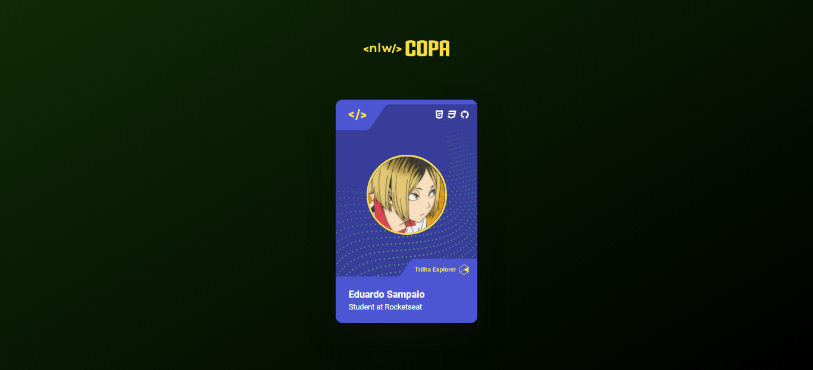

<h1 align="center"> NLW Copa - Card </h1>

Esquenta para o evento NLW Copa, promovido pela Rocketseat.

  <a href="#-tecnologias">Tecnologias</a>&nbsp;&nbsp;&nbsp;|&nbsp;&nbsp;&nbsp;
  <a href="#-projeto">Projeto</a>&nbsp;&nbsp;&nbsp;|&nbsp;&nbsp;&nbsp;
  <a href="#-layout">Layout</a>&nbsp;&nbsp;&nbsp;|&nbsp;&nbsp;&nbsp;

 

  

## 🚀 Tecnologias

Esse projeto foi desenvolvido com as seguintes tecnologias:

- HTML e CSS
- JavaScript

## 💻 Sobre o projeto

Esse projeto consiste em um card simples para o próximo evento da Rocketseat, o NLW Copa.
No card, é possível ver o nome do estudante e uma imagem que o represente, juntamente com a trilha do evento na qual ele participará.

### Funcionalidades

Ao clicar no card, a trilha e a cor do cartão serão alteradas.

### Preview

[Clique aqui](https://edusmpaio.github.io/nlw-copa-card/) para acessar o projeto.
